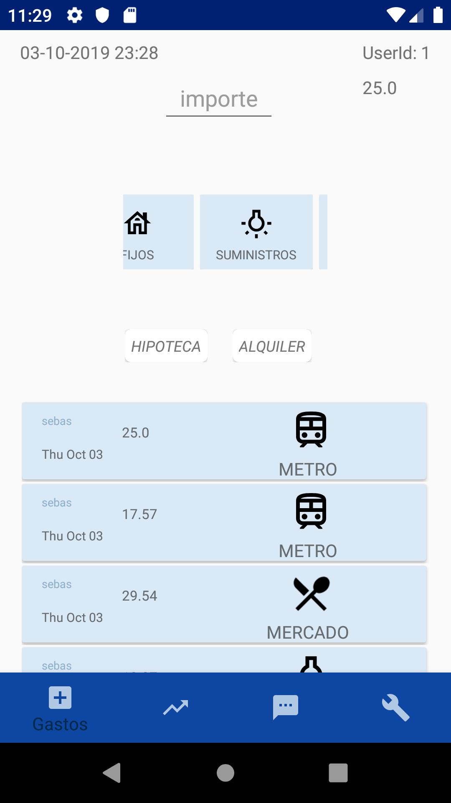
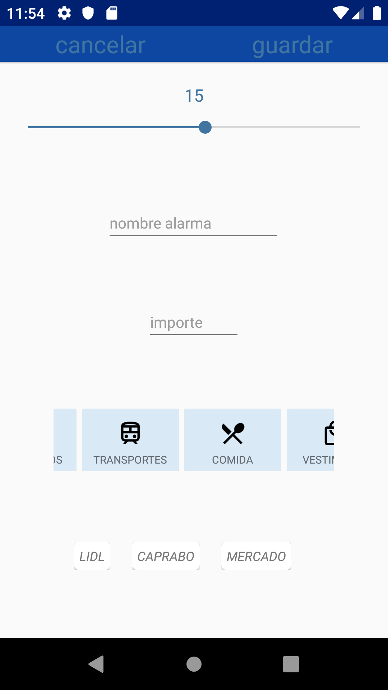
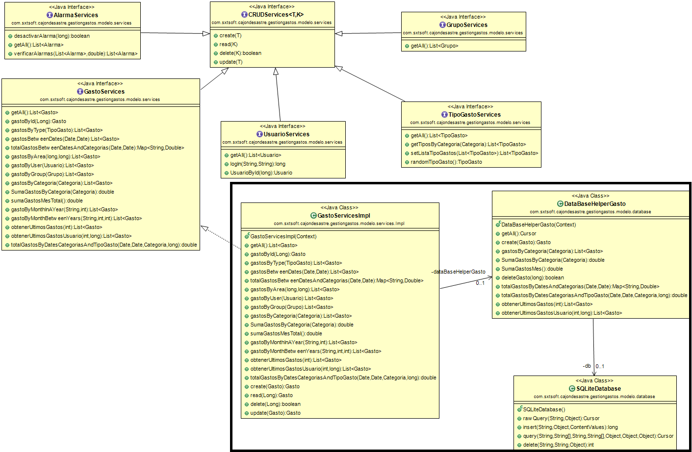

# gestion gastos

Aplicación que ayuda a gestionar y visualizar tus gastos personales y familiares

  - visualizar gastos "hormigas"
  - stadísticas
  - sistema de gestion de alarmas
  
# Objetivos

Tener un control sobre los gastos que se originan en lo cotidiano y en un nucleo familiar, pudiendo agregar miembros al nucleo. La app está focalizada en los gastos no sobre los ingresos. Es posible realizar un seguimiento de los gastos mediante gráficas estadisticas y notificaciones que alerten sobre los gastos en períodos que el usuario fije.  

# Guia de Usuario

Se ha intentado enfocar en la simplicidad a la hora de incorporar los gastos. La app cuando se ejecute por primera vez solicitará datos de usuario con una clave que serán almacenados en la db. Una vez se haya hecho el login cada vez que se ejecute irá directamente al "alta de gasto". 

La aplicacion propone al usuario catalogar el gasto en categorias (ENUM) y subcategorias (llamadas tipos de gastos), los tipos de gastos pueden ser modificados y/o eliminados.

> Una vez logeado, no será necesario volver a hacerlo
>
> y directamente nos solicitará ingresar el gasto.

El ingreso requiere de:

- Ingresar el valor en euros
- seleccionar una categoría
- seleccionar un tipo de gasto (subcategoría)

El gasto será agregado a la lista y computado en las gráficas y estadísticas.

La app muestra los últimos movimientos realizados.

### Estadisticas

En esta sección podrás:
  - visualizar gastos por caracteristicas
  - realizar busquedas en rangos de fechas

### Alarmas

La app posee un sistema de alarmas o notificaciones que se encargarán de alertar al usuario en caso de que un gasto, en un ciclo del mes fijado, excediese lo estipulado. 

> Las mismas puede anularse, eliminarse (mediante swipe) o modificarse.
> el usuario puede hacer un click sobre la notificacion activa y la 
> misma pasará a estar "vista".
>El ciclo mensual de la misma se realizará en el alta de la alarma.

Al agregar una alarma se indica un nombre de la misma, el ciclo en días mediante un deslizador, la categoría y un tipo de gasto o subcategoría.

# Modelo y diagrama uml

## UML Interfaces

> El recuadro muestra la relacion de implementación y uso de una de las interfaces, 
> todas poseen su correspondiente implementación.

### Tecnologia utilizada

- [AndroidStudio 3.5](https://developer.android.com/studio) - IDE desarrollo Android
- [java](https://java.com/es/)
- [SQLite](https://www.sqlite.org/index.html)
- [MPAndroidchart](https://github.com/PhilJay/MPAndroidChart) -  Android chart view / graph
- API > 15

# Estructura de proyecto

| Paquete | Clase/Interfaces |
| ------- | ---------------- |
| adapters | AdapterRvAlarma |
|          | AdapterRvCategorias |
|          | AdapterRvHistoricosGastos |
|          | AdapterRvTiposGastosSel |
|          | AdapterRvTipoGasto |
| database | DatabaseHelper |
|          | DatabaseHelperAlarma |
|          | DatabaseHelperGasto |
|          | DatabaseHelperTipoGasto |
|          | DatabaseHelperUsuario |
|          | Utilidades |
| fragments | AlarmaFragment |
|           | AltaGastoFragment |
|           | GraficaFragment |
| interfaces | AlarmaServices |
|            | CRUDServices |
|            | GastoServices |
|            | GrupoServices |
|            | TipoGastoServices |
|            | UsuarioServices |
| interfaces/Impl | AlarmaServicesImpl |
|                 | GastoServicesImpl |
|                 | TipoGastoServicesImpl |
|                 | UsuarioServicesImpl |
| model | Alarma |
|       | Categoria |
|       | Gasto |
|       | Gender |
|       | Grupo |
|       | TipoGasto |
|       | Usuario |
| raiz | AltaAlarma |
|      | AltaTipoGasto |
|      | AltaUsuario |
|      | HomeActivity |
|      | LogIn |
|      | SeparatorDecoration |

# Objetivos aún no alcanzados

- No se ha podido profundizar en la gráficas de subcategorias y sus gastos, ni en variar el tipo de gráfico a visualizar (de barra, linear o pastel).
- Faltan los accesos a los menúes de configuración
- Falta incorporar la capacidad de trabajar conjuntamente más de un usuario.
- Falta realizar un estudio sobre gastos pequeños sin control que se estén produciendo
- Debe realizarse una mejora en las interfaces gráficas.
- control de errores

# Autor

* **Sebastian Turone**

# Agradecimientos

* **CIFO la Violeta** - imposible sin este increíble lugar que tanto hace por completar la formación.
* **Jordi** - el profe que tanta pasión le pone al código y tanto me ha enseñado a su estructura.
* **MPAndroidchart** - Ha sido fundamental en las gráficas
